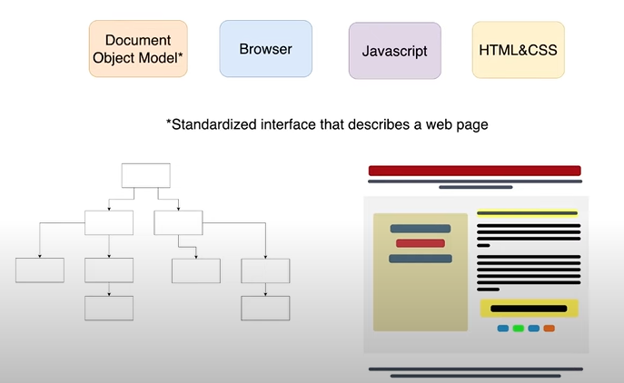

# Dom Basic

> Dom is standized interface that describe web
>  >  > 

## Things we can do with dom

> We can do all of the CRUD opererations

1.  create html css
2.  read html css
3.  update html css
4.  delete html css
    

| Point                    | Description                                                                                                                                                                                                         |
| ------------------------ | ------------------------------------------------------------------------------------------------------------------------------------------------------------------------------------------------------------------- |
| Accessing Elements       | You can select elements in the DOM using methods like `getElementById`, `getElementsByClassName`, `getElementsByTagName`, `querySelector`, and `querySelectorAll`.                                                  |
| Modifying HTML Content   | You can change the content of HTML elements using properties like `innerHTML` or `textContent`, or by directly manipulating the DOM structure using methods like `appendChild`, `removeChild`, `insertBefore`, etc. |
| Modifying Attributes     | You can change HTML attributes of elements using properties like `setAttribute`, `getAttribute`, `removeAttribute`, or by directly accessing properties like `id`, `className`, `src`, `href`, etc.                 |
| Styling Elements         | You can change the appearance of elements by modifying their CSS properties using the `style` property or by adding/removing CSS classes using the `classList` property.                                            |
| Event Handling           | You can attach event listeners to DOM elements to respond to user interactions (like clicks, mouse movements, key presses, etc.) using methods like `addEventListener`.                                             |
| Creating Elements        | You can dynamically create new HTML elements using methods like `createElement`, and then add them to the DOM using methods like `appendChild`.                                                                     |
| Traversing the DOM       | You can navigate through the DOM tree using properties like `parentNode`, `childNodes`, `firstChild`, `lastChild`, `nextSibling`, and `previousSibling`.                                                            |
| Manipulating Stylesheets | You can dynamically modify stylesheets by accessing and modifying the `style` property of DOM elements or by directly manipulating the `style` properties of CSS rules.                                             |
| Form Handling            | You can manipulate form elements, their values, and submission behavior using methods like `submit`, `reset`, and by accessing form elements' properties like `value`, `checked`, etc.                              |

| Point                           | Description                                                                                                                                                                          |
| ------------------------------- | ------------------------------------------------------------------------------------------------------------------------------------------------------------------------------------ |
| Dynamic Content Loading         | You can fetch data from a server using APIs like Fetch or XMLHttpRequest and then dynamically update the DOM with the received data.                                                 |
| Manipulating Stylesheets        | In addition to directly modifying element styles, you can dynamically load, add, remove, or modify stylesheets in the document using JavaScript.                                     |
| Drag and Drop                   | You can implement drag-and-drop functionality by handling events like `dragstart`, `dragover`, `drop`, etc., to allow users to drag elements around the page.                        |
| Client-Side Validation          | You can perform client-side validation of form inputs by accessing form elements and their properties, and then providing feedback to users based on validation rules.               |
| Dynamic Animations              | You can create animations by modifying CSS properties over time using JavaScript, either directly or by using libraries like CSS animations or JavaScript animation libraries.       |
| Scrolling Behavior              | You can control scrolling behavior on the page by modifying the `scrollTop` or `scrollLeft` properties of elements, or by using methods like `scrollTo` or `scrollIntoView`.         |
| LocalStorage and SessionStorage | You can use the `localStorage` and `sessionStorage` APIs to store data locally on the user's browser and retrieve it later, allowing for persistent data storage across sessions.    |
| Responsive Design               | You can dynamically modify the DOM based on the device's screen size or orientation to create responsive web designs that adapt to different viewing environments.                   |
| Accessibility                   | You can use the DOM to enhance the accessibility of your web pages by programmatically setting attributes like `aria-*` to provide additional information to assistive technologies. |
| SVG Manipulation                | If your page includes Scalable Vector Graphics (SVG), you can manipulate SVG elements within the DOM using JavaScript to create interactive visualizations or animations.            |
